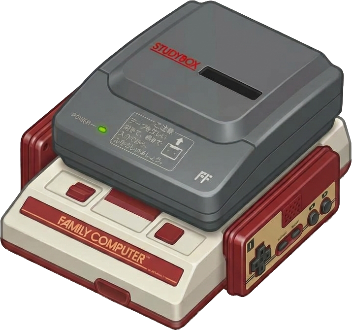

<table>
  <tr>
    <td width="144" valign="middle">
      
    </td>
    <td valign="middle">
      <h1>studybox-dumper</h1>
      <p>Turn StudyBox cassette recordings into <code>.studybox</code> files that <a href="https://github.com/SourMesen/Mesen2">Mesen2</a> can load and play. The desktop app decodes and verifies recordings, and can help recover whole pages from another recording of the same program. Each container holds decoded pages and a mono narration track (or silence when the capture has no narration).</p>
    </td>
  </tr>
</table>

StudyBox data is stored as 4800 bps MFM on the data track of a stereo cassette.
The decoder recovers the analog signal, tracks the MFM clock, checks framing and
packet checksums, and writes the container Mesen2 expects. It reports detected
signal losses rather than inventing missing data.

## Start here

- **You have a `.studybox` file:** [play it in Mesen2](#play-a-dump-in-mesen2).
- **You have a physical tape or an audio recording:** use the
  [GUI workflow](#decode-with-the-gui). If you have a tape, start with the
  recording instructions there.
- **You prefer the terminal or want to script decoding:** see
  [command-line use](#command-line-use).

## Play a dump in Mesen2

You do **not** need this tool or Python to play a `.studybox` file. The StudyBox
BIOS is required, but is not included with this project.

1. Obtain the StudyBox BIOS through lawful means. Mesen2 expects a headerless
   `StudyBox.bin` in its `Firmware/` folder. If your BIOS file has an iNES
   header, strip the first 16 bytes before placing it there.
2. Open Mesen2 and load the `.studybox` file (for example, through **File →
   Open**).
3. If the file loads but the game does not boot, check that the BIOS is present,
   named `StudyBox.bin`, and headerless.

This repository contains no copyrighted ROMs, BIOS files, or tape captures.

## Decode with the GUI

The GUI is the recommended way to turn a tape or recording into a `.studybox`
file. It is included with each prebuilt release; no Python installation is
needed to run those builds.

### Get and launch the app

Download the ZIP for your platform from the project's GitHub Releases page and
extract it:

| Platform | Release ZIP |
| --- | --- |
| Windows (64-bit) | `studybox-win-x64.zip` |
| Linux (64-bit) | `studybox-linux-x64.zip` |
| macOS (Intel) | `studybox-mac-x64.zip` |
| macOS (Apple silicon) | `studybox-mac-arm64.zip` |

Choose the macOS build that matches your Mac: Apple silicon for M-series
machines, Intel for older Macs. The ZIPs contain both the GUI and command-line
programs. After extraction, launch the GUI as follows:

- **Windows:** run `studybox/studybox-gui.exe`.
- **Linux:** run `./studybox/studybox-gui` from the extracted directory.
- **macOS:** open `StudyBox Dumper.app`.

Keep the extracted `studybox/` folder together on Windows and Linux; do not move
the GUI executable out of it. Keep the `.app` bundle intact on macOS. These are
unsigned builds, so your operating system may show a first-launch warning:

- **macOS (Gatekeeper):** Control-click the app in Finder, choose **Open**, and
  confirm. Alternatively, run
  `xattr -dr com.apple.quarantine "StudyBox Dumper.app"`.
- **Windows (SmartScreen):** choose **More info**, then **Run anyway**.

### Record a tape

If you already have a recording, skip to [Decode and verify](#decode-and-verify).
Otherwise, connect the deck's line or headphone output to a recorder and record
the **whole side** in stereo:

- **Left channel:** narration audio.
- **Right channel:** the 4800 bps MFM data signal.

Use a cassette deck that can play the tape and a stereo recorder, such as a USB
audio interface or sound card line-in. A sample rate of 44.1 kHz is recommended;
48 and 96 kHz are also covered by tests. Save a lossless WAV (PCM) or FLAC
recording. The reader can attempt WAV, FLAC, and Ogg files; explicit file
selections may also use other formats supported by the installed `libsndfile`
build. Lossy Ogg-encapsulated audio (such as Vorbis) and MP3 can distort data
transitions, so treat those as best-effort inputs.

For a reliable capture:

- Set recording gain before the take. Leave headroom so peaks stay below
  **0 dBFS**; about **-12 to -6 dBFS** is a useful target.
- Do not apply noise reduction, hiss removal, compression, or EQ; processing can
  distort the data signal.
- Start recording a few seconds before the data begins so the complete lead-in
  tone is captured. The decoder uses it to establish byte alignment.
- Record the whole side in one pass; avoid editing or trimming the audio.
- If a capture is too quiet, increase the recorder's input gain; if it clips,
  decrease it. Set the gain before recording again and keep peaks below 0 dBFS.

#### Example: record with Audacity

[Audacity](https://www.audacityteam.org/) works with common USB audio interfaces.
Control names vary slightly by version, but the important settings are:

1. In **Audio Setup**, select the interface connected to the cassette deck and
   choose **2 (Stereo) Recording Channels**. Use a stereo line input rather than
   a mono laptop microphone input.
2. Set the **Project Sample Rate** to **44,100 Hz**. Check that the left channel
   carries narration and the right channel carries data.
3. Set recording gain before the take. Leave headroom below **0 dBFS** and do
   not adjust gain while recording.
4. Record the whole side, including a few seconds before the data lead-in. Do
   not apply effects such as Noise Reduction, Normalize, compression, or EQ.
5. Use **File → Export Audio** to export the full stereo recording as
   **WAV (Microsoft)** with **Signed 16-bit PCM** encoding, or as FLAC. 24-bit
   PCM is also fine if available. Do not export a mono mix or convert it to a
   lossy format.

Keep the lossless export as the original capture; the `.studybox` does not
preserve the source data-track recording.

### Decode and verify

1. On the GUI's **Decode** tab, choose a capture file. Its filename can be
   anything. The data-channel default is channel 1 (the right channel in a
   standard stereo capture); select channel 0 if your data is on the left or if
   the capture is mono.
2. Choose an **Output .studybox** path and click **Decode**. The log shows a
   summary and per-page report. Select **Write JSON sidecar** if you also want
   the decode report saved next to the container. If you decode both sides,
   save them to distinct paths such as `side-a.studybox` and `side-b.studybox`.
3. Click **Verify** to re-decode the selected capture and run the strict
   capture-level verification gate. This button checks the selected capture,
   not an existing `.studybox` file.

The optional **Seconds** field limits processing to the first N seconds for a
quick diagnostic. Clock and page boundaries are estimated from that partial
signal, so results can differ from a full decode. **Embed silence when narration
is missing** creates a container with silence; it does not recover narration.

See [what verification means](#verification-and-recovery-reference) for the
limits of a clean pass. If verification reports losses or you suspect missing
pages and have a capture from the other side, decode it to a separate
`.studybox` before [merging the results](#recover-pages-from-another-recording).
After a clean pass, [open the `.studybox` in Mesen2](#play-a-dump-in-mesen2).

### Recover pages from another recording

Both sides of a StudyBox cassette usually carry the same digital pages, so a
page cut by a dropout on one side can often be completed from the other. Merge
when verification reports losses or you suspect pages are missing; a clean pass
cannot rule out every undetected loss. Decode the other side's capture file to
a separate `.studybox`, then use the GUI's **Merge** tab:

1. Choose the first `.studybox` as **Base .studybox**. This file supplies the
   narration audio and page offsets for the result.
2. Add the other recording(s) under **Other recordings**.
3. Choose an output path and click **Merge**. Select **Write provenance JSON**
   to save the per-page source report.

The inputs must be recordings of the same program with the same page count.
Pages are selected whole; bytes are never spliced between recordings. The GUI
reports repaired pages and open conflicts, then verifies the output. A passing
verification does not resolve an open merge conflict: inspect the provenance
JSON's `open` entries before treating those pages as recovered. You should only
merge your own recordings.

## Verification and recovery reference

The decoder does not invent bytes beyond the observed signal. Verification
independently re-parses the stored page bytes.

- For a capture, `verify: PASS` means every retained page is complete (it ended
  at a valid end control), every checked packet checksum passed, and there were
  no diagnosed non-benign capture losses.
- For a `.studybox`, `verify: PASS` means its stored pages pass those checks and
  its embedded audio and offsets are valid. It cannot tell whether pages were
  lost before the container was created; keep the original capture and optional
  decode report for capture-level diagnostics.
- `PASS (degraded)` is available only through the CLI's explicit
  `--allow-degraded` or sub-1.0 `--min-checksum-rate` options. Incomplete pages
  still fail: completeness is structural and cannot be waived.

**Pages cut by a dropout:** a page without a valid end control is incomplete.
Detectable partial-byte cutoffs are recorded as `unobserved_eof`; a lost byte
marker is recorded as `mid_page_desync`. Some incomplete endings have no precise
location in the dropout map. Re-record the damaged section to recover the tail.

**Coverage limits:** a clean pass is strong evidence for the retained bytes, not
proof that every original page survived. The discarded-page scan needs a
detectable lead-in and enough observed header slots. It tolerates at most two
wrong fixed header values (`C5 01 01 01 01`) plus nonzero header markers in
total; heavier damage can go undiagnosed. Positional inspection of damaged
markers is diagnostic only: it never repairs or emits page bytes. Type-5 padding
is unchecksummed and is exempt only within its recognized skip range, up to the
next `C5`, when its containing page is complete, structurally sound,
checksum-clean, and free of parser desynchronization. Signal resembling a
damaged page wholly inside that padding is ambiguous and may not be diagnosed.

**Known false-rejection case:** a long zero run followed by an exact page-header
pattern inside a valid checksummed payload can be mistaken for a page boundary.
The reproduced case produces incomplete pages and verification failure. Its
prevalence on real tapes is unknown; fixing it requires changing page-boundary
selection, so the decoder does not guess around it.

If checks report dropouts or incomplete pages, investigate the reported region.
It may be recording damage or a decoder limitation such as the case above. For
suspected recording damage, clean the heads, check azimuth and tape speed, keep
levels steady, and re-record that section. If both sides were recorded, try the
merge workflow first.

## Troubleshooting

| Symptom | Likely cause / fix |
| --- | --- |
| Decode reports **0 pages** | Data may be on the wrong channel, or recording may start after the lead-in. Select the other channel or re-record with a few seconds of lead-in. |
| `verify: FAIL`, many dropouts | Tape damage or a poor recording. Clean the heads, check azimuth and tape speed, keep levels steady, and record without noise reduction. |
| Packet checksums fail | The signal may be too quiet, clipped, or affected by tape-speed variation. Adjust recording gain without clipping and try another capture. |
| The game loads in Mesen2 but will not boot | The BIOS may be missing, misnamed, or not headerless. See [Play a dump in Mesen2](#play-a-dump-in-mesen2). |
| A long recording takes time to decode | Decoding reads audio in windows. Use the GUI's **Seconds** field or the CLI's `--seconds N` for a partial diagnostic; its results may differ from a full decode. |

## Command-line use

The prebuilt ZIPs also include the `studybox` command-line program in the
extracted `studybox/` folder (`studybox.exe` on Windows, `studybox` on Linux and
macOS). To run from source, use Python 3.10 or newer and run these commands from
the project directory in a checkout or extracted source archive:

```console
python -m pip install .
studybox-gui
```

The install provides both `studybox` and `studybox-gui`; run `studybox-gui` to
open the window. The GUI requires a Python installation with Tkinter available.
The following CLI examples use `python -m studybox`; after installation, you can
use the shorter `studybox` command instead. Input filenames are unrestricted:
pass each recording's file path directly.

```console
python -m studybox decode "Side A recording.wav" --studybox side-a.studybox --json side-a.json
python -m studybox verify "Side A recording.wav"
python -m studybox roundtrip "Side A recording.wav"
```

If verification reports losses in Side A, decode Side B to a separate container
and merge the two:

```console
python -m studybox decode "Side B recording.wav" --studybox side-b.studybox
python -m studybox merge side-a.studybox side-b.studybox \
    --studybox recovered.studybox --json merge-report.json
python -m studybox verify --studybox recovered.studybox
```

Inspect `merge-report.json` for any `open` conflicts; a passing container
verification does not resolve them. If Side A verifies cleanly and no pages are
suspected missing, there is usually no need to decode or merge Side B.

To verify the saved container itself, run
`python -m studybox verify --studybox MyTape.studybox`.

| Command | Purpose |
| --- | --- |
| `studybox decode` | Decode a capture, report pages and checksums, optionally write a `.studybox` and decode JSON sidecar |
| `studybox verify` | Run the independent verification gate on a capture or, with `--studybox`, an existing container |
| `studybox roundtrip` | Check bit-level MFM round-trip agreement against the source capture |
| `studybox report` | Render a saved **decode** JSON sidecar as text |
| `studybox merge` | Recover whole pages from another recording of the same program |

Capture options are available to `decode`, `verify` (when given a capture), and
`roundtrip`:

- `--data-channel N` selects the data channel in an explicit multichannel file
  (default: channel 1, the right channel in a standard stereo capture).
- `--side A|B` selects a side from the CLI's optional directory input, which
  uses the resolver's recognized filename patterns. For arbitrary filenames,
  pass the recording file directly; no side option is needed.
- `--seconds N` limits processing to the first N seconds for a quick diagnostic;
  results can differ from a full decode.

Other options are command-specific: `decode --no-audio` embeds silence when a
capture has no narration track. `verify --allow-degraded` and
`verify --min-checksum-rate R` opt into tolerant verification; the requested
checksum-rate floor remains mandatory. Run
`python -m studybox <command> --help` for the full options and examples.

To render a saved decode report without re-decoding:

```console
python -m studybox report MyTape.json
```

## Tests

From a source checkout or extracted source archive with the project dependencies
installed, run the self-contained suite. It synthesizes MFM signals with the
project's own encoder:

```console
python3 -m unittest discover -s tests -v
```

## License

GNU Affero General Public License, version 3 or any later version
(AGPL-3.0-or-later). See [LICENSE](LICENSE).

If you run a modified version as a network service, AGPL section 13 requires
offering its source to users.
